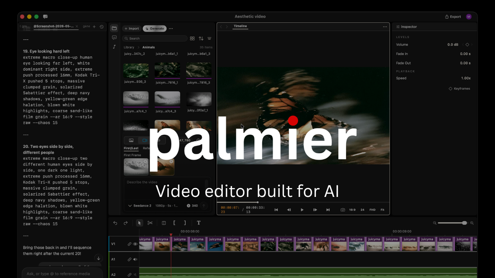

<div align="center">

# HoTF Editor

**The video editor built for AI.**

<a href="https://github.com/thehotf/hotf-editor/releases/latest/download/HoTFEditor.dmg">
  
</a>

<sub><i>Requires macOS 26 (Tahoe) on Apple Silicon</i></sub>

<a href="https://x.com/HoTFEditor_io"></a>
<a href="https://discord.com/invite/SMVW6pKYmg"></a>

</div>



---

HoTF Editor is an open source video editor for Mac. You and your agent can generate and edit videos together inside the timeline.

### Swift-native video editor

We built HoTF Editor from scratch with Swift. The north star is Premiere Pro, with our take on integrating AI into the workflow.

### Built-in Generative AI

Generate videos and images with SOTA models like Seedance, Kling, Nano Banana Pro inside the timeline editor.

### Integrates with your agents

Connects your Claude/Codex/Cursor via MCP, or use the in-app agent to work on the same project together.

## MCP server

When the app is open, it exposes an MCP server at `http://127.0.0.1:19789/mcp` via HTTP. To connect:

**Claude Code**
```bash
claude mcp add --transport http hotf-editor http://127.0.0.1:19789/mcp
```

**Codex**
```bash
codex mcp add hotf-editor --url http://127.0.0.1:19789/mcp
```

**Cursor**

The easiest way is go inside the app `Help` -> `MCP Instructions` -> `Install in Cursor`, or install manually by adding this to `~/.cursor/mcp.json`:

```
{
  "mcpServers": {
    "hotf-editor": {
      "type": "http",
      "url": "http://127.0.0.1:19789/mcp"
    }
  }
}
```

**Claude Desktop**

We bundle a [mcpb](https://github.com/modelcontextprotocol/mcpb) with the app that allows a one click install Desktop Extension on Claude Desktop. Go to `Help` -> `MCP Instructions` -> `Install in Claude Desktop`

## FAQ

**Is HoTF Editor fully open source?**

The video editor (without the generative AI features) is fully open source. The MCP server and the agent chat are also open source. The only thing that is closed source is the generative AI processing.

**Is it free?**

The editor is free. You can download it with no login required, and use it as a video editor like CapCut or Adobe Premiere. You can also use the MCP server for free, and start experimenting using Claude Code/Desktop or Cursor to interact with your timeline editor.

Generative AI features require login and subscription.

**What platforms does it support?**

macOS 26 (Tahoe) on Apple Silicon only.

See [FAQ.md](FAQ.md) for more.

## Development

See [CONTRIBUTING.md](CONTRIBUTING.md)

## License

Copyright (C) 2026 HoTF Editor, Inc.

HoTF Editor is open source under [GPLv3](LICENSE).